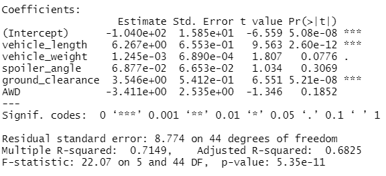

# MechaCar_Statistical_Analysis

## Linear Regression to Predict MPG(miles per gallon)
The MechaCar prototypes were produced using multiple design specifications to identify ideal vehicle performance. 
Five of those characteristic were used to determine their relation with MPG
1. Which variables/coefficients provided a non-random amount of variance to the mpg values in the dataset?
  -Vehicle_length and ground_clearance
2. Is the slope of the linear model considered to be zero? Why or why not?  No. Given our r-vaue (0.71) we know there is a strong positive correlation between some o our variables 
3. Does this linear model predict mpg of MechaCar prototypes effectively? Why or why not? r-squared value was 0.71, wich means we can predict about 70% of the data with our model. To have better results, we could change some of the features that have random amount of variance to the mpg, such as vehicle_lenght, spioler_angle and AWD.

